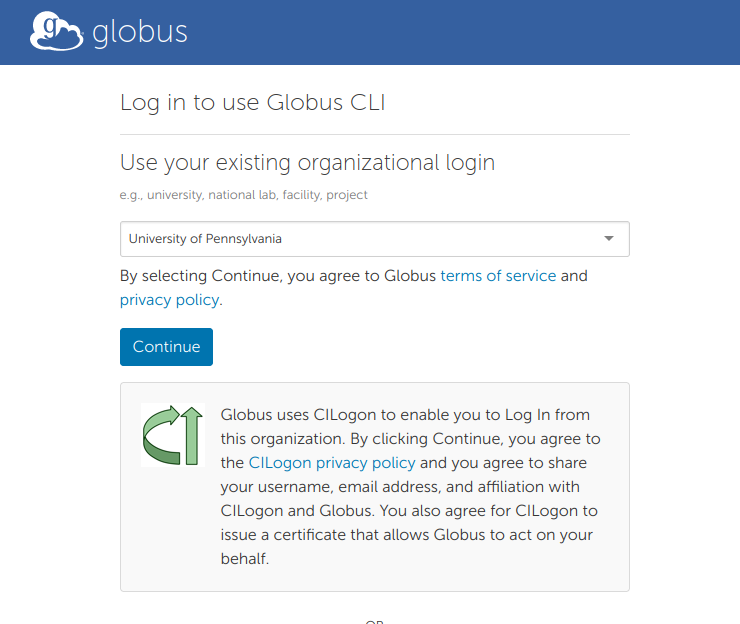
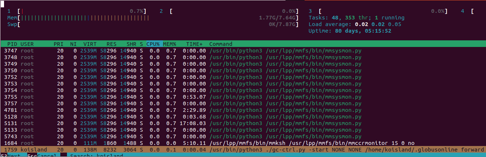

# Globus
Globus is a useful CLI/online tool to transfer research data via endpoints and collections. It is faster and easier than rsync and similar tools.

### Getting Started
SSH into the following hosts in separate terminal windows.

* [Epistasis queue](https://wiki.pmacs.upenn.edu/public/Epistasis_lab) for setting up a collection.
    ```bash
    ssh $USER@sarlacc.pmacs.upenn.edu
    ```

* `sciglobus` for Globus Personal Connect
    ```bash
    ssh $USER@sciglobus.pmacs.upenn.edu
    ```

### Install [`globus-cli`](https://docs.globus.org/cli/)
Next, we'll install [`globus-cli`](https://docs.globus.org/cli/) via conda.

Load `miniconda` and create an environment for `globus-cli`.
```bash
module load miniconda
eval "$(/appl/miniconda3-22.11/bin/conda shell.bash hook)"
```
* See [Bash Aliases - Conda](bash_aliases.md#conda) for a quick bash alias.


```bash
conda create --name globus python
conda activate globus && pip install globus-cli
```

### Login to Globus
```bash
globus login
```

Follow the link and allow Globus CLI any needed permissions.
```bash
Please authenticate with Globus here:
------------------------------------
https://auth.globus.org/v2/oauth2/authorize?client_id=...
------------------------------------

Enter the resulting Authorization Code here:
```



Then copy the Native App Authorization code into your terminal.

You should now be logged in.

### Creating a Globus Connect Personal Mapped Collection
Here, we create an collection we will transfer to and from.
* https://docs.globus.org/cli/reference/gcp_create_mapped/

```bash
ENDPT_NAME="LPC_LOGSDON_LAB"
```

```bash
globus gcp create mapped \
--default-directory /project/logsdon_shared/ \
--force-encryption \
--private "${ENDPT_NAME}"
```

You will see a confirmation message. Copy the Setup Key.
```
Message:       Endpoint created successfully
Collection ID: 00649ae8-c6b1-11ee-ac79-f3913dc167ec
Setup Key:     6f589c8f-d2c8-4c61-94b9-1983afd6fe53
```

You should also see the collection @ https://app.globus.org/collections?scope=administered-by-me.


### Setting up a Globus Connect Personal Endpoint.
To set up our endpoint, we'll run Globus Connect Personal setup command on the dedicated `sciglobus.pmacs.upenn.edu` host.

```bash
# Put your setup key here.
ENDPT_SETUP_KEY=""
```
```bash
globusconnectpersonal -setup "${ENDPT_SETUP_KEY}"
```
```
setup completed successfully
```

By default, only the `/home/$USER` will be accessible and any attempt to access other directories will result in the [following error](https://docs.globus.org/globus-connect-personal/troubleshooting-guide/#you_get_path_not_allowed_errors_when_attempting_to_directly_access_a_particular_path_on_your_personal_endpoint):
```
Denied by endpoint, Command Failed: Error (list)
Endpoint: YOUR_PERSONAL_ENDPOINT_NAME (YOUR_PERSONAL_ENDPOINT_UUID)
Server: Globus Connect
Command: MLST /some/path/
Message: Fatal FTP Response
---
Details: 500 Command failed : Path not allowed.
```

To fix this the Accessible Folders setting must be modified by appending the paths we need.
```bash
echo "/project/logsdon_shared,0,1" >> ~/.globusonline/lta/config-paths
```

This should be `~/.globusonline/lta/config-paths` after the command.
* For information on the fields, refer to the docs [here](https://docs.globus.org/globus-connect-personal/install/linux/#config-paths).
```bash
~/,0,1
/project/logsdon_shared,0,1
```

### Running Globus Connect Personal in the Background
Finally, we'll use [`nohup`](https://www.digitalocean.com/community/tutorials/nohup-command-in-linux) to run the Globus Connect Personal as a background process.

```bash
nohup globusconnect -start > globuspersonalconnect.log 2>&1 &
```
* See [Bash Aliases - Globus Connect Personal](bash_aliases.md#globus-connect-personal) for a quick bash alias.

The endpoint should now be ready!


To close the endpoint, either kill the process with its PID
```bash
kill ???
```

Or use `htop` to locate the process and kill it.



> **Be sure to kill this process at some point.**
