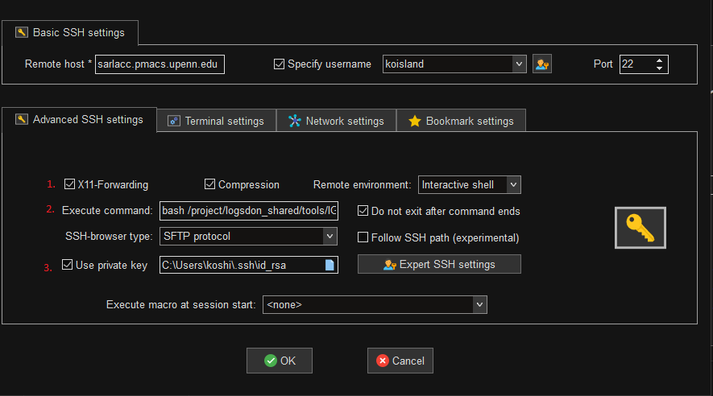

# IGV
IGV or Integrative Genomics Viewer allows visualizing genomics data.

### Setup SSH client for X11 forwarding.
Windows
* [MobaXterm](https://mobaxterm.mobatek.net/)

Mac
* [XQuartz](https://www.xquartz.org/)

### Connect with X11 forwarding enabled.
> [!NOTE]
> This should be from your desktop.

```bash
ssh -Y $USER@sarlacc.pmacs.upenn.edu
```

### IGV Startup Command
Once connected to the LPC with X forwarding, run the IGV script stored at `/project/logsdon_shared/tools/IGV_Linux_2.19.1/`  
```bash
bash /project/logsdon_shared/tools/IGV_Linux_2.19.1/igv.sh
```

### MobaXterm (Optional)
For easier access, create an SSH connection with:
1. `X11-Forwarding` enabled
2. `Execute command` set to [IGV startup command](#igv-startup-command)
    * `Do not exit after command ends` set.
3. `Use private key` set to your SSH private key.

This should allow you to startup IGV with a single-click.



### XQuartz (Optional)
Install from here:
* https://www.xquartz.org/

Then connect and run the same script.
```bash
ssh -Y $USER@sarlacc.pmacs.upenn.edu
```

```bash
bash /project/logsdon_shared/tools/IGV_Linux_2.19.1/igv.sh
```

> [!NOTE]
> It has been know than Mac users have issues with IGV and a black screen.
> * https://github.com/igvteam/igv/issues/1352
>
> To fix this, you can export this Java option or add this to your `~/.bashrc`

```bash
export _JAVA_OPTIONS='-Dsun.java2d.xrender=false -Dsun.java2d.pmoffscreen=false'
```
